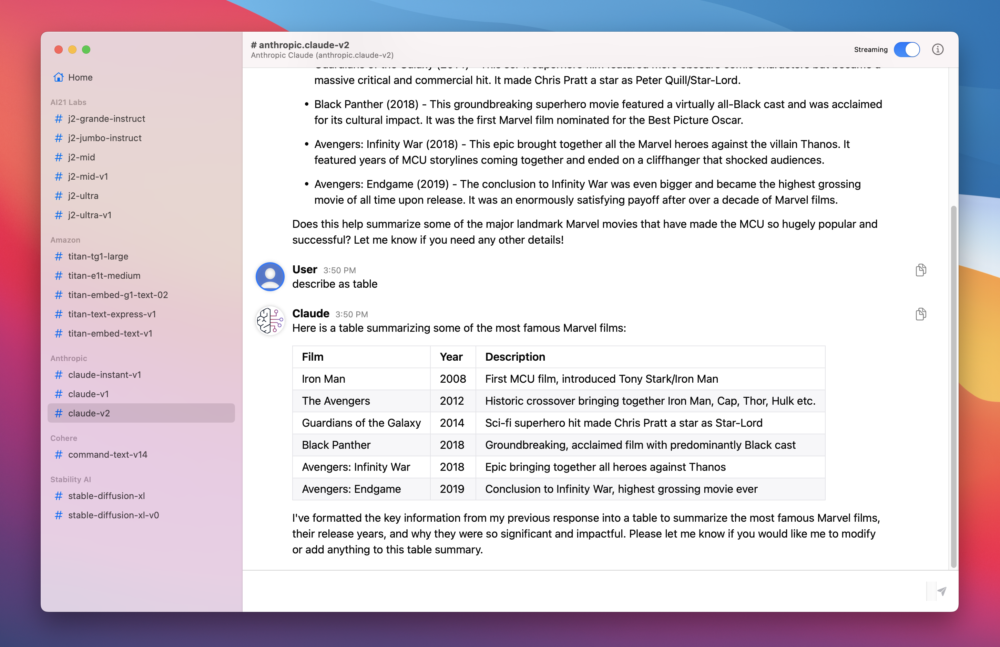
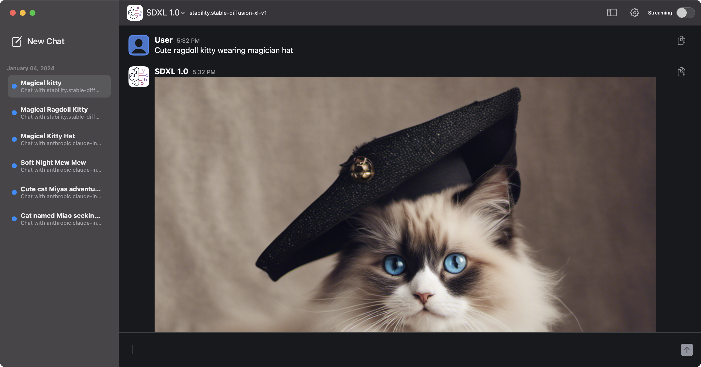
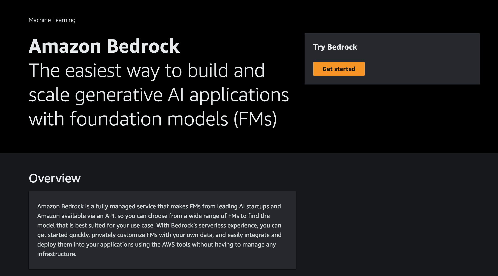
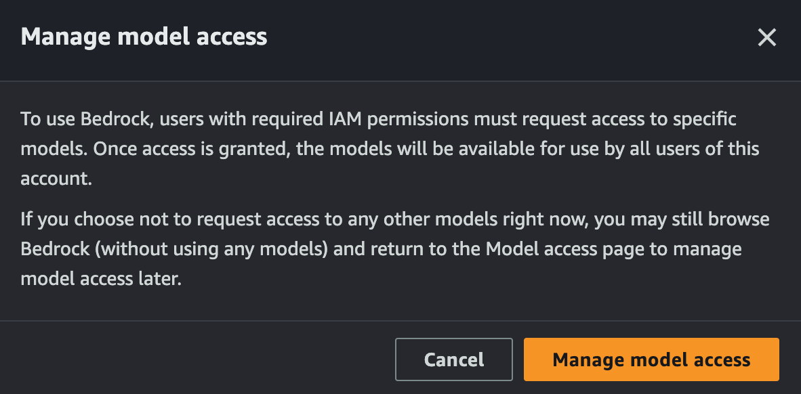
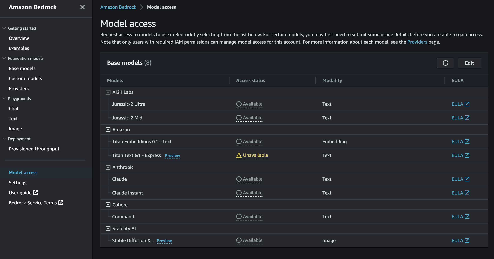

Amazon Bedrock Client for Mac
=============================

[](https://github.com/aws-samples/amazon-bedrock-client-for-mac/releases/latest)

[](https://opensource.org/license/mit-0/)
[](https://developer.apple.com/macos/)
[](https://swift.org)

Overview
--------

The Amazon Bedrock Client for Mac is a macOS demo application built with SwiftUI. It serves as a client interface for AWS Bedrock, allowing users to interact with AWS Bedrock models.




> **Note**
> Please see the [AWS Bedrock Pricing](https://aws.amazon.com/ko/bedrock/pricing/) page for details and make sure to understand the costs before using the application.

## Main Features

|  	| Features Highlights 	|
|---	|---------------------------------------------------------------------------------	|
| 🌐 	| Seamless interaction with AWS Bedrock models	|
| 💌 	| Real-time message sending and receiving 	|
| 📷 	| Support for generating images 	|
| 📝 	| Text generation and embedding within the application	|
| 🔒 	| Data encryption for enhanced security at rest and in transit	|
| 🌓 	| Native support for Dark Mode to reduce eye strain	|
| 🚀 	| Fully made in Swift 5 for high performance and reliability 	|

Download
--------

To download the pre-compiled application, click on the following link:

[Download Amazon Bedrock Client for Mac](https://github.com/aws-samples/amazon-bedrock-client-for-mac/releases/latest/download/Amazon.Bedrock.Client.for.Mac.dmg)


Troubleshooting
---------------

### 1. Amazon Bedrock Client for Mac.app Can't Be Opened

You encounter a message stating "'Amazon Bedrock Client for Mac.app' can't be opened because Apple cannot check it for malicious software."


Steps to Open the Application:

1. Open Finder -> Navigate to "Amazon Bedrock Client for Mac.app"
2. Right-click (or Control-click)
3. Select Open
4. Click Open in the dialog

### 2. Issues with AWS Tokens

You encounter error messages like "Token has expired" or "The security token included in the request is invalid."

Before proceeding with the following steps, ensure that your ~/.aws/credentials file is correctly configured. The file should include your AWS Access Key ID and Secret Access Key in the following format:

```ini
[default]
aws_access_key_id = YOUR_ACCESS_KEY_ID
aws_secret_access_key = YOUR_SECRET_ACCESS_KEY
```

Steps to Manually Update AWS Credentials from Environment Variables:

1. Open your Terminal.

2. Update AWS Credentials: Run the following commands to set your AWS credentials. Replace the environment variable placeholders with your actual credentials if you did not set .

    ```sh
    # change $AWS.. Environment Variable to your one
    aws configure set default.aws_access_key_id $AWS_ACCESS_KEY_ID
    aws configure set default.aws_secret_access_key $AWS_SECRET_ACCESS_KEY
    ```

    If you have aws_session_token:
    ```sh
    # change $AWS.. Environment Variable to your one
    aws configure set default.aws_access_key_id $AWS_ACCESS_KEY_ID
    aws configure set default.aws_secret_access_key $AWS_SECRET_ACCESS_KEY
    aws configure set default.aws_session_token $AWS_SESSION_TOKEN
    ```

### 3. Troubleshooting Model Access Issues

If you encounter model access issues, please follow the steps below:

#### Step 1: Navigate to Amazon Bedrock Console
Go to [Amazon Bedrock console](https://us-east-1.console.aws.amazon.com/bedrock/home?region=us-east-1#/).


#### Step 2: Manage Model Access
Click on the 'Manage Model Access' button.


#### Step 3: Model Access
Click on the 'Model access' tab.


#### Step 4: Edit Model Access
Edit the 'Model access' settings. Check the box next to 'Anthropic' and then click 'Save Changes'.


Build Instructions
------------------

### Prerequisites

*   macOS 12 or later
*   Xcode 13 or later
*   AWS Account

### Steps

1.  Clone the repository
    
    ```sh
    git clone https://github.com/aws-samples/amazon-bedrock-client-for-mac.git
    ```
    
2.  Open the project in Xcode
    
    ```sh
    cd Amazon-Bedrock-Client-for-Mac
    open Amazon\ Bedrock\ Client\ for\ Mac.xcodeproj/
    ```
    
3.  Set up your AWS credentials and configure your AWS settings.
    
4.  Build and run the application on your Mac.
    
Usage
-----

1.  **Sidebar**: Use the sidebar to navigate between your preferences and channels.
2.  **Message Bar**: Use the message bar at the bottom to send messages to AWS Bedrock.
3.  **Alerts**: The app provides alerts for various activities and errors, displayed in a pop-up window.

Security
--------

This application was written for demonstration and educational purposes and not for production use. The Security Pillar of the [AWS Well-Architected Framework](https://docs.aws.amazon.com/wellarchitected/latest/security-pillar/welcome.html) can support you in further adopting the sample into a production deployment in addition to your own established processes.

Contributing
------------

1.  Fork the project.
2.  Create your feature branch ( `git checkout -b feature/YourFeature`).
3.  Commit your changes ( `git commit -am 'Add some feature'`).
4.  Push to the branch ( `git push origin feature/YourFeature`).
5.  Open a pull request.

License
-------

This project is licensed under the MIT License - see the [LICENSE](LICENSE) file for details.