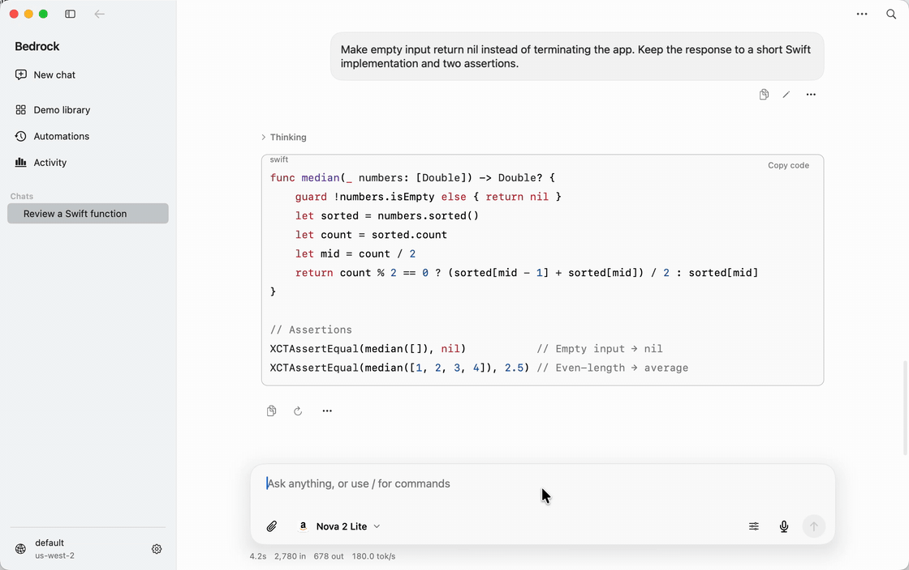
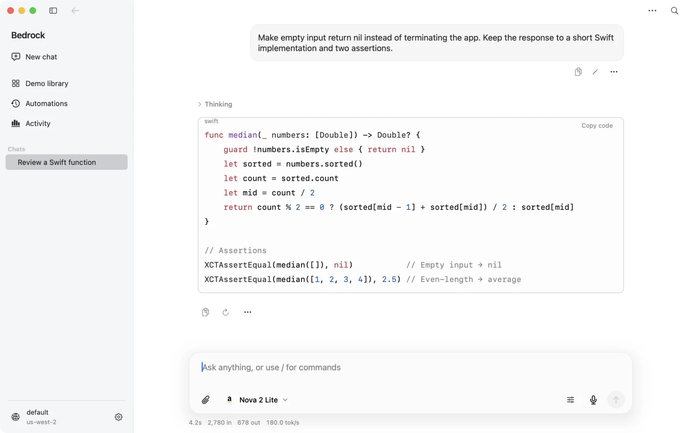

<h1 align="center">Bedrock for Mac</h1>

<p align="center">
  <strong>Amazon Bedrock. At home on your Mac.</strong><br />
  A Swift app for conversations, documents, images, and local tools.<br />
  Your models, a direct AWS connection, and a little more room to work.
</p>

<p align="center">
  <a href="https://github.com/aws-samples/amazon-bedrock-client-for-mac/releases/latest"><strong>Download for Mac</strong></a>
  &nbsp;·&nbsp; <a href="#build">Build from source</a>
  &nbsp;·&nbsp; <a href="TROUBLESHOOTING.md">Get help</a>
  &nbsp;·&nbsp; <a href="CONTRIBUTING.md">Contribute</a>
</p>

[](#requirements)
[](#build)
[](https://github.com/aws-samples/amazon-bedrock-client-for-mac/releases/latest)
[](https://github.com/aws-samples/amazon-bedrock-client-for-mac/actions/workflows/validate.yml)
[](LICENSE)



<p align="center"><sub>Recorded from the running app with demonstration data. <a href="assets/preview.png">View a still image</a> · <a href="docs/SCREENSHOTS.md">Capture details</a></sub></p>

## Made for the conversation

- **Models within reach.** Search and favorite models from the composer. Switch models in an existing conversation, keeping its context and draft. Settings has one default-model picker with an immutable model ID.
- **A comfortable native interface.** Light, Dark, and System appearance; a full-height frosted sidebar; restrained controls; adjustable text; and a centered composer for a new conversation.
- **Attachments that stay with your work.** Paste text, images, and browser content, or attach documents, source code, and configuration files. Inspect attachments before sending. Large text becomes an editable attachment, and unsent attachment drafts survive a restart.
- **Readable answers.** Native Markdown selection across paragraphs, lists, tables, and code. Copy exact code or the complete Markdown response. Image previews support zoom, copy, and saving the original image.
- **Room for the next thought.** Queue another message during a response, including its model, skills, and attachments. Edit or remove queued work, interrupt and send now, or resume a paused queue.
- **History without clutter.** Search across local conversations, find within the current chat, edit a prompt, retry a response, or branch from a message. Archive and Trash share one view in Settings.

<details>
<summary>Light, Dark, or your system appearance</summary>
<p>
  <picture>
    <source media="(prefers-color-scheme: dark)" srcset="assets/readme/main-dark.webp" />
    
  </picture>
</p>
</details>

## Skills, tools, and demos

**Local skills** are reusable `SKILL.md` instructions. Import or create them in Settings → Skills, inspect their references, and select one with `/` in the composer. Models can also discover enabled skills and load their instructions when needed.

**Built-in tools** read, search, and write local files; inspect Git; run shell commands; fetch pages; and load skills. Tools are enabled with permissive local access by default. Settings → Tools & MCP lets you change the tool preset, individual tools, approval behavior, working directory, file allowlist, timeouts, and output limits.

The file allowlist applies to built-in file operations. Shell commands and Git run with your macOS account's permissions and their own tool enablement, approval, timeout, and cancellation settings.

**MCP connections** support local stdio servers and HTTP servers. Manage servers and individual tools in Settings. In a conversation, expand a tool call to inspect its original input, output, timing, or error. Larger output has a separate searchable detail view.

**Demo library** provides prompts for conversation, reasoning, documents, vision, local tools, images, video, embeddings, and model comparison. Each demo checks task/model compatibility; attachment-dependent demos explain the required input. Video generation requires an S3 output bucket.

**Automations and Activity** keep repeatable prompts and their results on this Mac. Schedules run while the app is open, new schedules start paused, and missed runs are skipped after sleep or restart. Activity shows reported token usage, timings, tool counts, and errors.

## Direct connection, local storage

Conversations, drafts, skills, schedules, and settings are stored locally. There is no hosted app backend, relay, account system, or conversation sync.

Model requests and the context you include go directly to Amazon Bedrock. Enabled web tools and configured MCP servers make their own connections. Optional update checks contact GitHub. Bedrock API keys are stored in macOS Keychain; AWS profiles use your local AWS configuration.

The app discovers foundation models and inference profiles for your connection and region. It supports Bedrock Converse and Mantle Responses routes, with dedicated image, video, and embedding requests where implemented. Access and capabilities depend on your AWS account, region, and endpoint. Retired models are excluded from new selections; existing conversations remain readable.

## Get started

### Install

Download the latest signed app from [Releases](https://github.com/aws-samples/amazon-bedrock-client-for-mac/releases/latest), or use the existing Homebrew tap:

```sh
brew tap didhd/tap
brew install amazon-bedrock-client
```

The screenshots and source on the default branch can include changes that have not yet shipped in a release.

### Connect

1. Configure an AWS profile with Bedrock access. Profiles can use credentials, SSO, or `credential_process`.
2. Open **Settings → AWS connection**, then choose the profile and region.
3. Select **Test connection & refresh models**.
4. Choose a model in the composer and send a message.

For SSO, sign in using your profile before connecting:

```sh
aws sso login --profile your-profile
```

An optional Bedrock API key can be entered in AWS connection settings for compatible Mantle requests.

## Keyboard

| Action | Shortcut |
| --- | --- |
| New chat | `⌘N` |
| Move current chat to Trash | `⌘D` |
| Show/hide sidebar | `⌘B` |
| Back | `⌘[` |
| Search conversations and commands | `⌘K` |
| Find in current conversation | `⌘F` |
| Settings | `⌘,` |
| Import a conversation | `⌘⇧O` |
| Quick Access | `⌥Space` by default; configurable |
| Show Quick Access from the app | `⌘⇧K` |
| Adjust conversation text | `⌘+`, `⌘−`, `⌘0` |

Choose Return or `⌘Return` for sending in Settings → Keyboard. Escape dismisses search and preview/detail sheets.

## Requirements

- macOS 14 or later. Liquid Glass is used on macOS 26 and later, with a compatible appearance on earlier systems.
- An AWS account/profile with access to the models you want to use.
- Network access for inference. Local storage does not make Bedrock inference offline.

## Build

Open `Amazon Bedrock Client for Mac.xcodeproj` in a current Xcode with Swift 6 and the macOS 26 SDK or later. Select the **Amazon Bedrock Client for Mac** scheme and your Mac.

The committed `Package.resolved` pins the dependency graph. For a local unsigned Release build:

```sh
xcodebuild build \
  -project "Amazon Bedrock Client for Mac.xcodeproj" \
  -scheme "Amazon Bedrock Client for Mac" \
  -configuration Release \
  -destination "platform=macOS" \
  -derivedDataPath .build/xcode \
  -onlyUsePackageVersionsFromResolvedFile \
  CODE_SIGNING_ALLOWED=NO
```

Signing and notarization are separate release steps. See [development and validation](docs/DEVELOPMENT.md) for tests, isolated app data, and performance checks.

```text
Sources/Bedrock/           Swift app, native views, local core, and resources
Tests/Integration/        App, rendering, clipboard, image, and MCP regressions
Tests/LocalWorkbenchTests/ Storage, migration, routing, tools, and queue tests
Tests/UITests/            Native interaction scenarios
Tests/Fixtures/           Deterministic inputs and a local MCP server
Configuration/            App Info.plist and entitlements
scripts/                  Source registration and validation commands
docs/                     Development, compatibility, and validation evidence
assets/                   Screenshots and demo media
```

## Contributing

See [CONTRIBUTING.md](CONTRIBUTING.md). Include a reproducible scenario and the checks you ran. Performance changes should include the workload, build configuration, and measurements.

The [performance report](docs/PERFORMANCE.md) records comparable Release measurements, and the [validation matrix](docs/PERFORMANCE_VALIDATION_MATRIX.md) separates executed checks from work that remains.

This project uses the [MIT-0 license](LICENSE) and the [Amazon Open Source Code of Conduct](CODE_OF_CONDUCT.md).
