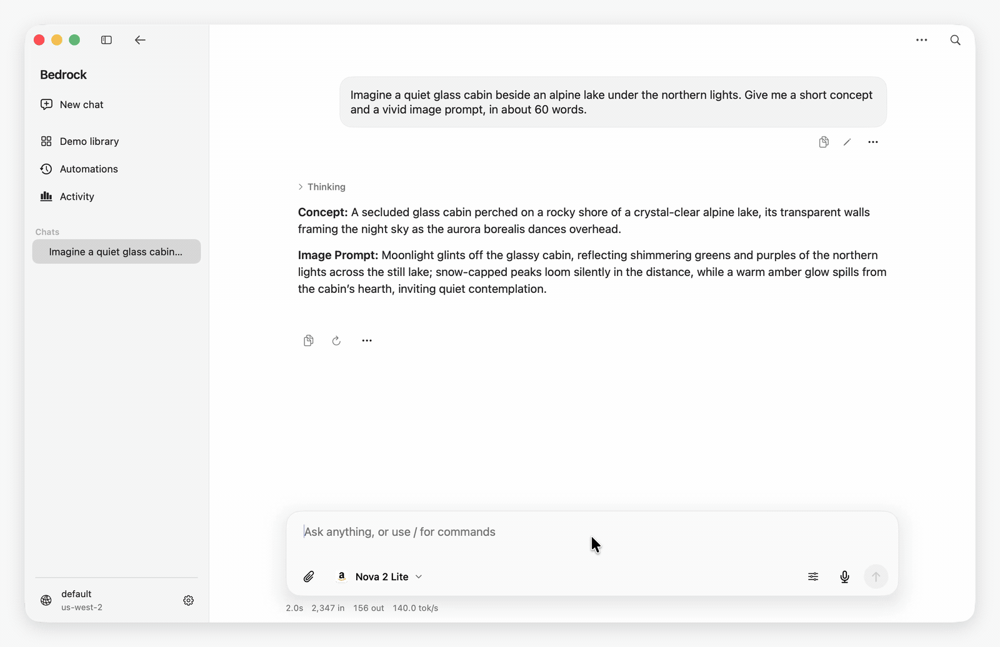
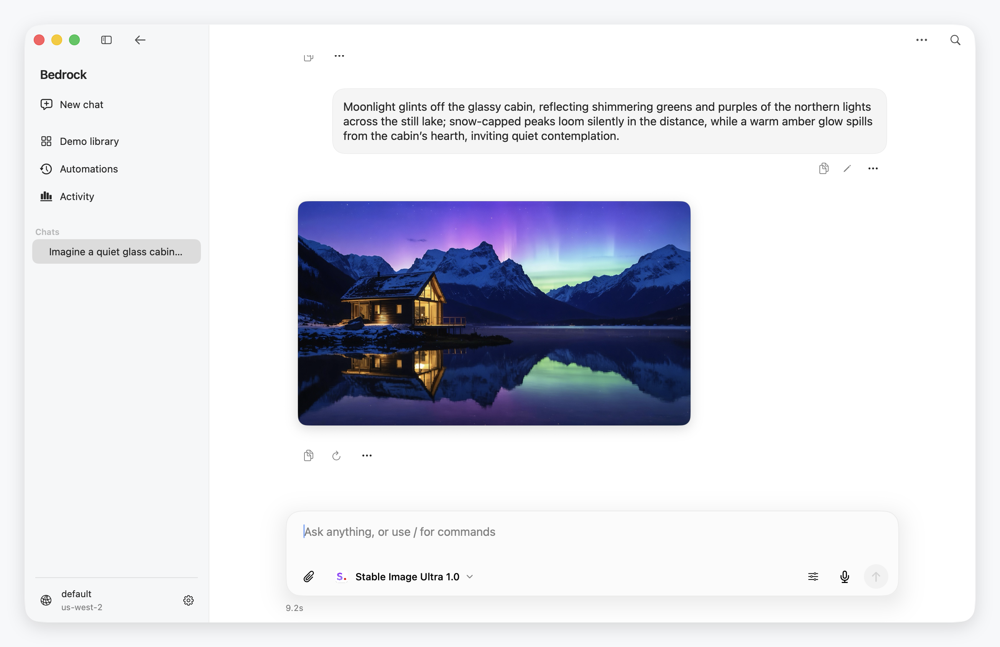
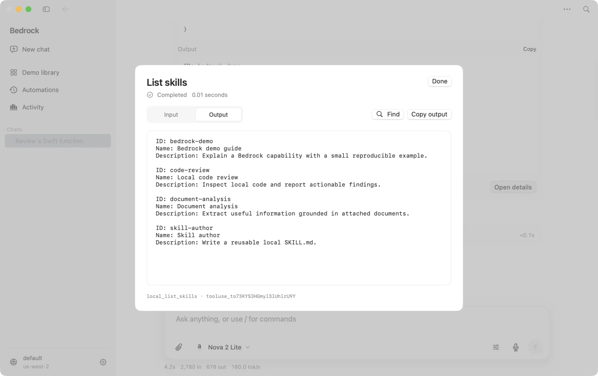
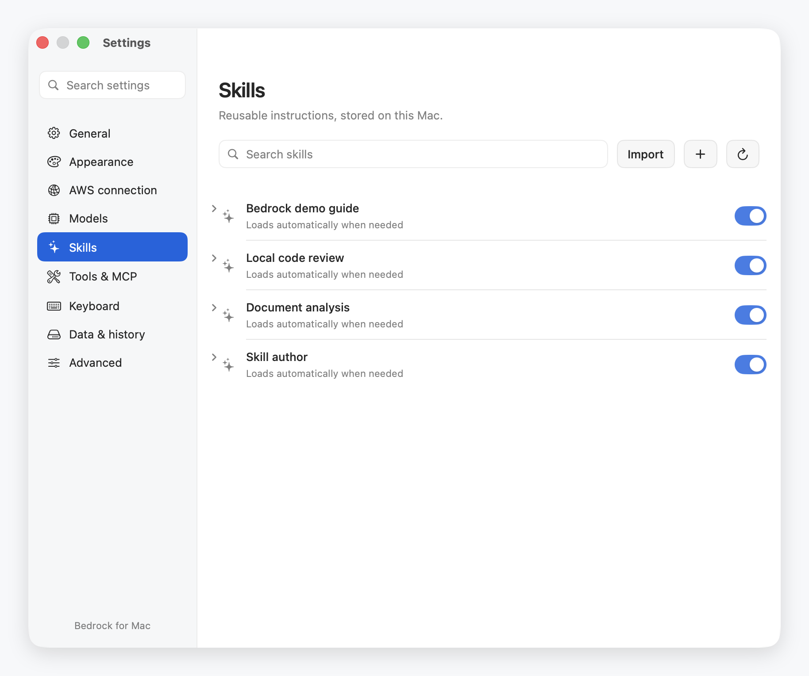

<h1 align="center">Bedrock for Mac</h1>

<p align="center">
  <strong>Amazon Bedrock. At home on your Mac.</strong><br />
  A native Swift app for conversations, documents, images, and local tools.<br />
  Connect directly to AWS. Keep your conversations on your Mac.
</p>

<p align="center">
  <a href="https://github.com/aws-samples/amazon-bedrock-client-for-mac/releases/latest/download/Amazon.Bedrock.Client.for.Mac.dmg"></a>
</p>

<p align="center">
  <a href="#build">Build from source</a>
  &nbsp;·&nbsp; <a href="docs/troubleshooting.md">Get help</a>
  &nbsp;·&nbsp; <a href="CONTRIBUTING.md">Contribute</a>
</p>

<p align="center">
  <picture>
    <source media="(prefers-reduced-motion: reduce)" srcset="docs/assets/hero.png" />
    <source type="image/webp" srcset="docs/assets/demo.webp" />
    
  </picture>
</p>

<p align="center">
  <strong>From a thought to an image.</strong><br />
  <sub>Develop an idea with GPT-6 Astra at Low effort, switch to Stable Image Ultra 1.0, and open the result.</sub>
</p>

## Made for the conversation

- **Models within reach.** Search and favorite models from the composer. Switch models in an existing conversation, keeping its context and draft. Settings has one default-model picker with an immutable model ID.
- **A comfortable native interface.** Light, Dark, and System appearance; a full-height frosted sidebar; restrained controls; adjustable text; and a centered composer for a new conversation.
- **Attachments that stay with your work.** Paste text, images, and browser content, or attach documents, source code, and configuration files. Inspect attachments before sending. Large text becomes an editable attachment, and unsent attachment drafts survive a restart.
- **Readable answers.** Select across paragraphs, lists, tables, and code, and paste with rich formatting. Copy-response and code buttons preserve the original Markdown and code. Image previews support zoom, copy, and saving the original image.
- **Room for the next thought.** Queue another message during a response, including its model, skills, and attachments. Edit or remove queued work, interrupt and send now, or resume a paused queue.
- **History without clutter.** Browse chats by date and collapse sidebar sections when you want more space. Scroll the complete conversation without loading pages. Search across local conversations, find within the current chat, edit a prompt, retry a response, or branch from a message. Recover archived conversations in Settings.

<details>
<summary>Light, Dark, or your system appearance</summary>
<p align="center">
  <picture>
    <source media="(prefers-color-scheme: dark)" srcset="docs/assets/chat-dark.webp" />
    
  </picture>
</p>
</details>

## Skills, tools, and demos

**Local skills** are reusable `SKILL.md` instructions. Import or create them in Settings → Skills, inspect their references, and select one with `/` in the composer. Models can also discover enabled skills and load their instructions when needed.

**Built-in tools** read, search, and write local files; inspect images and Git; run shell commands; find saved conversations; manage local automations; fetch pages; and load skills. Tools are enabled with permissive local access by default. Settings → Tools & MCP lets you change the tool preset, individual tools, approval behavior, working directory, file allowlist, timeouts, and output limits.

The file allowlist applies to built-in file operations. Shell commands and Git run with your macOS account's permissions and their own tool enablement, approval, timeout, and cancellation settings.

**MCP connections** support local stdio servers and HTTP servers. Manage servers and individual tools in Settings. In a conversation, expand a tool call to inspect its original input, output, timing, or error. Larger output has a separate searchable detail view.

<details>
<summary>Inspect tools and manage local skills</summary>
<p align="center">
  
</p>
<p align="center">
  <picture>
    <source media="(prefers-color-scheme: dark)" srcset="docs/assets/settings-dark.webp" />
    
  </picture>
</p>
</details>

**Demo library** provides prompts for conversation, reasoning, documents, vision, local tools, images, video, embeddings, and model comparison. Each demo checks task/model compatibility; attachment-dependent demos explain the required input. Video generation requires an S3 output bucket.

**Automations and Activity** keep repeatable prompts and their results on this Mac. Schedules run while the app is open, new schedules start paused, and missed runs are skipped after sleep or restart. Activity shows reported token usage, timings, tool counts, and errors.

## Direct connection, local storage

Conversations, drafts, skills, schedules, and settings are stored locally. There is no hosted app backend, relay, account system, or conversation sync.

Model requests and the context you include go directly to Amazon Bedrock. Enabled web tools and configured MCP servers make their own connections. Optional update checks contact GitHub. Bedrock API keys are stored in macOS Keychain; AWS profiles use your local AWS configuration.

The app discovers foundation models and inference profiles for your connection and region. It supports Bedrock Converse and Mantle Responses routes, with dedicated image, video, and embedding requests where implemented. Access and capabilities depend on your AWS account, region, and endpoint. Retired models are excluded from new selections; existing conversations remain readable.

## Get started

### Install

[Download the latest DMG](https://github.com/aws-samples/amazon-bedrock-client-for-mac/releases/latest/download/Amazon.Bedrock.Client.for.Mac.dmg), open it, and drag **Amazon Bedrock** into **Applications**.

Alternatively, install with Homebrew:

```sh
brew tap didhd/tap
brew install amazon-bedrock-client
```

The DMG contains a universal app for Apple silicon and Intel, signed with Developer ID and notarized by Apple.

Bedrock keeps the existing automatic update preference. Use **Bedrock → Check for Updates…**
or **Settings → General → Check now** to check manually. An approved update is downloaded
and verified before the app saves your work, replaces itself, and reopens. If replacement
fails, the previous app is restored. Conversations and settings stay in their existing location.

### Connect

1. Configure an AWS profile with Bedrock access. Profiles can use credentials, SSO, or `credential_process`.
2. Open **Settings → AWS connection**, then choose the profile and region.
3. Select **Test connection & refresh models**.
4. Choose a model in the composer and send a message.

For an SSO profile, select **Sign in with AWS SSO** in AWS connection settings and approve the request in your browser. The app supports both named `sso-session` configurations and legacy SSO profiles, and shares the standard local token cache with the AWS CLI.

You can also sign in from the terminal:

```sh
aws sso login --profile your-profile
```

An optional Bedrock API key can be entered in AWS connection settings for compatible Mantle requests.

## Keyboard

| Action | Shortcut |
| --- | --- |
| New chat | `⌘N` |
| Archive current chat | `⌘D` |
| Show/hide sidebar | `⌘B` |
| Back | `⌘[` |
| Search conversations and commands | `⌘K` |
| Find in current conversation | `⌘F` |
| Settings | `⌘,` |
| Import a conversation | `⌘⇧O` |
| Quick Access | `⌥Space` by default; configurable |
| Show Quick Access from the app | `⌘⇧K` |
| Adjust conversation text | `⌘+`, `⌘−`, `⌘0` |

Choose Return or `⌘Return` for sending in Settings → Keyboard. Escape dismisses search and preview/detail sheets.

## Requirements

- macOS 14 or later. Liquid Glass is used on macOS 26 and later, with a compatible appearance on earlier systems.
- An AWS account/profile with access to the models you want to use.
- Network access for inference. Local storage does not make Bedrock inference offline.

## Build

Open `Bedrock.xcodeproj` in a current Xcode with Swift 6 and the macOS 26 SDK or later. Select the **Bedrock** scheme and your Mac.

The committed `Package.resolved` pins the dependency graph. For a local unsigned Release build:

```sh
xcodebuild build \
  -project "Bedrock.xcodeproj" \
  -scheme Bedrock \
  -configuration Release \
  -destination "platform=macOS" \
  -derivedDataPath .build/xcode \
  -onlyUsePackageVersionsFromResolvedFile \
  CODE_SIGNING_ALLOWED=NO
```

Signing and notarization are separate release steps. See [development and validation](docs/development.md) for tests, isolated app data, and performance checks.

```text
Bedrock.xcodeproj/         App, integration tests, and UI test targets
Sources/Bedrock/
  App/                    Lifecycle, windows, navigation, and app state
  Core/                   Storage models, migration, routing, and local tools
  Services/               AWS, MCP, persistence, attachments, and system APIs
  Features/               Chat, composer, models, settings, demos, and skills
  UI/                     Design system, Markdown, and shared components
  Resources/              App icons, Core Data model, and offline resources
Tests/
  BedrockCoreTests/        Portable storage, migration, routing, and tool tests
  BedrockTests/            Native rendering, clipboard, image, and MCP tests
  BedrockUITests/          Actual app interaction scenarios
  Fixtures/               Deterministic Bedrock protocol and MCP servers
Configuration/            App Info.plist and entitlements
scripts/                  Build, validation, packaging, and preview commands
docs/                     Contributor guides, release notes, and media
```

## Tested before release

Run the relevant regression suites locally for a focused change. To reproduce
the complete GitHub CI pipeline on your Mac:

```sh
python3 scripts/ci.py
```

Full Xcode and an unlocked macOS desktop are required for the UI suite. The command saves logs, screenshots, an Xcode result bundle, and a receipt identifying the tested source files in `artifacts/`.

Every main push and pull request runs the same command in the [validation workflow](https://github.com/aws-samples/amazon-bedrock-client-for-mac/actions/workflows/ci.yml). It checks storage and migrations, native rendering and clipboard behavior, real MCP subprocesses, and UI interactions in an optimized Release app. Streaming, model switching, tools, queues, and attachments run through the actual AWS SDK against a local protocol fixture.

Release tags reuse successful main CI for the exact commit, verifying the recorded source hashes, executable permissions, and complete test results. The distribution then receives its own universal build, signature, notarization, and installation checks. Test logs, screenshots, request payloads, and performance measurements remain available as workflow artifacts. See the [scenario map](docs/testing.md) for coverage and live-test boundaries.

## Star History

<a href="https://www.star-history.com/?repos=aws-samples%2Famazon-bedrock-client-for-mac&type=date&releases=&legend=bottom-right">
 <picture>
   <source media="(prefers-color-scheme: dark)" srcset="https://api.star-history.com/chart?repos=aws-samples/amazon-bedrock-client-for-mac&type=date&theme=dark&legend=bottom-right" />
   <source media="(prefers-color-scheme: light)" srcset="https://api.star-history.com/chart?repos=aws-samples/amazon-bedrock-client-for-mac&type=date&legend=bottom-right" />
   
 </picture>
</a>

## Contributing

See [CONTRIBUTING.md](CONTRIBUTING.md). Include a reproducible scenario and the checks you ran. Performance changes should include the workload, build configuration, and measurements.

See the [performance report](docs/performance.md) for Release measurements and the [CI scenario map](docs/testing.md) for automated coverage and live-test boundaries.

This project uses the [MIT-0 license](LICENSE) and the [Amazon Open Source Code of Conduct](CODE_OF_CONDUCT.md).
