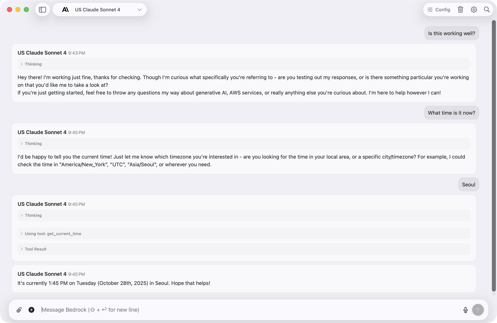

# Amazon Bedrock Client for Mac


[](https://github.com/aws-samples/amazon-bedrock-client-for-mac/releases/latest)
[](https://github.com/aws-samples/amazon-bedrock-client-for-mac/actions)
[](https://opensource.org/license/mit-0/)
[](https://developer.apple.com/macos/)
[](https://swift.org)

A modern, native macOS client for Amazon Bedrock, providing streamlined access to AI models directly from your desktop.

**[Download](#download) • [Features](#features) • [Getting Started](#getting-started) • [Usage](#usage) • [Troubleshooting](#troubleshooting) • [Contributing](#contributing)**

----

## Features

### Model Support
- Full access to Amazon Bedrock models including Claude 3.7 Sonnet, Llama, Mistral, DeepSeek R1, and Stable Diffusion
- Support for text generation, image generation, and embedding models
- Multi-modal capabilities with image upload for Claude 3 models
- Model Context Protocol (MCP) integration with tool use tracking and execution
- Enhanced reasoning capabilities with increased token budget (2048 tokens)

### User Experience
- Clean, native macOS interface with dark mode support
- Real-time streaming responses with Claude 3.7 thinking support
- Message history and conversation management
- In-chat search functionality (Cmd+F)
- Real-time voice transcription
- Keyboard shortcuts for font size adjustment, navigation, and sidebar toggle
- **Quick Access Window**: System-wide hotkey (Option+Space) for instant AI assistance from any application
- Consistent styling and animations across all views

### Document & Media Management
- Expanded functionality to handle both images and documents
- Document attachment support (PDF, Word, etc.) with proper rendering
- Modern image viewer modal
- Image compression and optimization utilities

### Developer Features
- AWS SSO and credential profile support
- Multi-region capabilities
- Custom system prompts and model parameters
- Code generation with syntax highlighting
- Unified ConverseStream API for all text generation models

## Download

Get the latest version:

<a href="https://github.com/aws-samples/amazon-bedrock-client-for-mac/releases/latest/download/Amazon.Bedrock.Client.for.Mac.dmg">
  
</a>

### Homebrew Installation

You can also install using Homebrew:

```bash
# Add the tap
brew tap didhd/tap
brew update

# Install Amazon Bedrock Client
brew install amazon-bedrock-client --no-quarantine
```

## Getting Started

### Requirements
- macOS 14 or later
- AWS Account with Bedrock access
- Configured AWS credentials

### Installation
1. Download and open the DMG file
2. Drag the app to your Applications folder
3. Launch the app and configure your AWS settings (ensure ~/.aws/credentials and ~/.aws/config are properly set up with your access keys or SSO configuration)

> **IMPORTANT:** When opening for the first time, macOS security features will block the application. You'll need to approve it manually in System Preferences > Privacy & Security by clicking "Open Anyway".


## Usage

### Basic Operation
1. Select your desired model from the dropdown
2. Type your message or query
3. Press Enter or click send
4. View the AI's response in the conversation view

### Advanced Features

- **Search**: Use Cmd+F to search through conversation history
- **Voice Input**: Click the microphone for speech-to-text
- **Image Upload**: Use the image button for visual inputs (Claude 3)
- **Document Upload**: Attach PDFs and other document formats
- **Model Settings**: Configure system prompts and parameters
- **AWS Profiles**: Switch between different credential profiles
- **Sidebar Toggle**: Use keyboard shortcut to show/hide sidebar

## Troubleshooting

For common issues and solutions, see our [Troubleshooting Guide](TROUBLESHOOTING.md).

### Common Issues
- AWS credential recognition problems
- Model access permissions
- Image generation formatting requirements
- Nova models compatibility (fixed in v1.2.11)

## Contributing

We welcome contributions from the community:

1. Fork the repository
2. Create a feature branch
3. Submit a pull request

## License

Licensed under the MIT License - see the [LICENSE](LICENSE) file for details.

## Star History

[](https://star-history.com/#aws-samples/amazon-bedrock-client-for-mac&Date)

---

<div align="center">
Developed by the AWS Community
</div>
