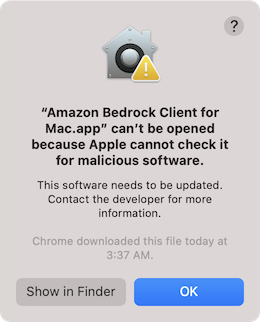

## 🛠️ Troubleshooting

### Opening the Application

If you see "'Amazon Bedrock Client for Mac.app' can't be opened because Apple cannot check it for malicious software":

1. Open System Preferences
2. Click Security & Privacy
3. Put a checkmark to "Allow apps downloaded from anywhere" -> Click OK and enter your password

Alternatively:
1. In Finder, locate "Amazon Bedrock Client for Mac.app"
2. Right-click (or Control-click) and select "Open"
3. Click "Open" in the dialog



### Amazon Bedrock Application Unexpectedly Quit

If you encounter an error message titled "Problem Report for Amazon Bedrock" with the details "Amazon Bedrock application unexpectedly quit", follow these steps:

1. Restart the Application: Click the "Reopen" button to attempt restarting the application.
2. Check AWS Credentials: Ensure that your `~/.aws/credentials` or `~/.aws/config` file is correctly configured. If the file doesn't exist, follow the instructions in the previous section to create it.

### AWS Token Issues

For "Token has expired", "Amazon_Bedrock.BedrockError error 1." or "The security token included in the request is invalid" errors:

You encounter error messages like "Token has expired" or "The security token included in the request is invalid."

Before proceeding with the following steps, ensure that your ~/.aws/credentials file is correctly configured. The file should include your AWS Access Key ID and Secret Access Key in the following format:

```ini
[default]
aws_access_key_id = YOUR_ACCESS_KEY_ID
aws_secret_access_key = YOUR_SECRET_ACCESS_KEY
```

Steps to Manually Update AWS Credentials from Environment Variables:

1. Open your Terminal.

2. Update AWS Credentials: Run the following commands to set your AWS credentials. Replace the environment variable placeholders with your actual credentials if you did not set .

    ```sh
    # change $AWS.. Environment Variable to your one
    aws configure set default.aws_access_key_id $AWS_ACCESS_KEY_ID
    aws configure set default.aws_secret_access_key $AWS_SECRET_ACCESS_KEY
    ```

    If you have aws_session_token:
    ```sh
    # change $AWS.. Environment Variable to your one
    aws configure set default.aws_access_key_id $AWS_ACCESS_KEY_ID
    aws configure set default.aws_secret_access_key $AWS_SECRET_ACCESS_KEY
    aws configure set default.aws_session_token $AWS_SESSION_TOKEN
    ```

### Model Access Issues

1. Go to the [Amazon Bedrock console](https://us-east-1.console.aws.amazon.com/bedrock/home?region=us-east-1#/)
2. Click "Manage Model Access"
3. Navigate to the "Model access" tab
4. Edit settings and ensure necessary models (e.g., Anthropic) are selected

I apologize for the confusion. I'll provide the entire section in English, including the content of the error message:
